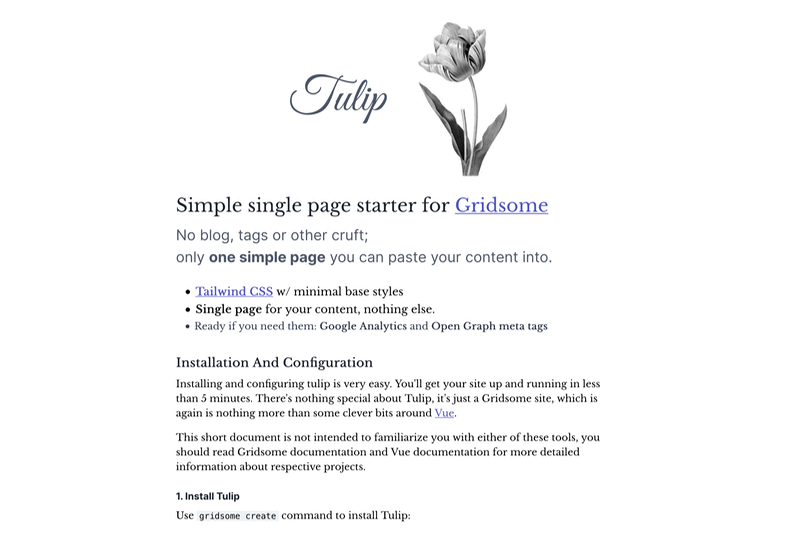

# Tulip

> Simple single page starter for Gridsome

[](https://app.netlify.com/start/deploy?repository=https://github.com/Uninen/gridsome-starter-tulip)

[](https://vercel.com/new/git/external?repository-url=https://github.com/Uninen/gridsome-starter-tulip)

### Preview / Demo



Live demo and documentation at: https://gridsome-starter-tulip.netlify.com/

### Features

No blog, tags or other cruft; only one simple page you can paste your content into.

- [Tailwind CSS](https://tailwindcss.com) w/ minimal base styles
- **Single page** for your content, nothing else.
- Ready if you need them: **Google Analytics** and **Open Graph** meta tags

### Installation And Configuration

First [make sure you have Gridsome installed](https://gridsome.org/docs/#how-to-install). Then run:

```sh
gridsome create my-website https://github.com/Uninen/gridsome-starter-tulip.git
```

Read and follow the [detailed configuration instructions](https://gridsome-starter-tulip.netlify.com/), you'll be done in less than 5 minutes.

### Contributing

Feel free to open a ticket if you feel something is broken or missing. All contributions are welcome, I only ask you to follow the [code of conduct](./CODE_OF_CONDUCT.md).

Lastly, Big Thank You to Gridsome and Vue teams for making these great tools! ❤️

### Support Open Source Development

Follow [@uninen on Twitter](https://twitter.com/uninen)

<a href="https://www.buymeacoffee.com/Uninen" target="_blank"></a>
